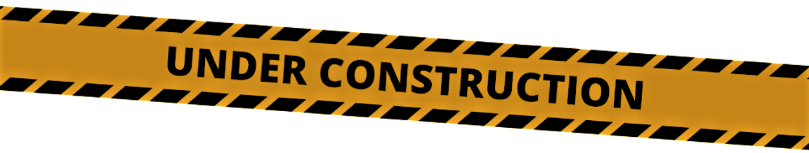

Exceptions
================================================================================

Below is the exception hierarchy used in PyConfig. When in doubt you can always
catch the base class :py:class:`~nx_config.NxConfigError`.

.. autoexception:: nx_config.NxConfigError
.. autoexception:: nx_config.ValidationError
.. autoexception:: nx_config.IncompleteSectionError
.. autoexception:: nx_config.ParsingError
